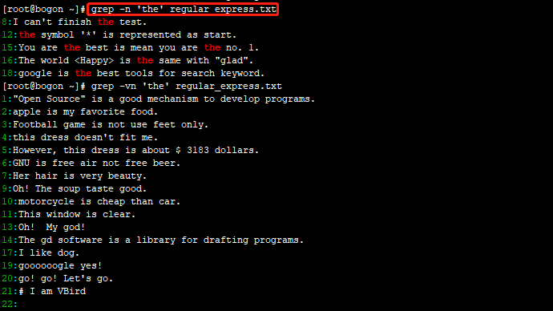
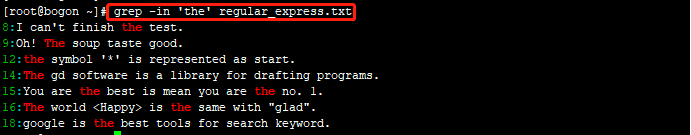
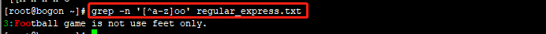
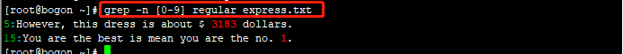
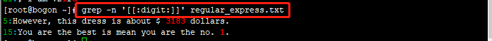
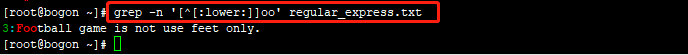

### 正则表达式与文件格式化处理

#### 一、什么是正则表达式

1. 定义：
> 处理字符串的方法，它是以行为单位来进行字符串的处理行为，正则表达式通过一些特殊符号的辅助，可以让用户轻易达到查找、删除、替换某特定字符串的处理程序。

	正则表达基本上是一种"表示法"， 只要工具程序支持这种表示方法，那么该工具程序就可以用来作为正则表达式的字符串处理之用。

2. 正则表达式对于系统管理员的用途
	
	系统的信息量很大，可以利用正则表达式的功能，仅取出需要的信息进行分析处理，为系统管理工作带来很多方便。
	
3. 扩展的正则表达式

正则表达式的字符串表示方式依照不同的严谨度而分为**基础正则表达式**与**扩展正则表达式**。

扩展型正则表达式除了简单的一组字符串处理之外，还可以做组的字符串处理，例如进行查找VBird 或 netman 或 lman的查找， 需要通过特殊的“（” 与“|”等字符的协助才能够完成。

#### 基础正则表达式

1. 语系对正则表达式的影响

由于不同语系的编码数据并不相同，所以造成数据选取结果有区别。zh_CN.big5及C这两种语系的结果分别如下：
		LANG=C时：01234...ABCD...Zabcd...z; 
		LANG=zh_CN时：01234...aAbBcCdD...zZ
使用正则表达式时，需要特别留意当时环境的语系为何，否则可能会发现与别人不相同的选取结果。接下来的联系使用'LANG=C'语系数据进行。

特殊符号的代表意义对应表如下：

| 特殊符号 |              代表意义                |
|:--------:|:-----------------------------------|
|**[:alnum:]**|代表英文大小写字符及数字，即 0-9, a-z, A-Z|
|**[:alpha:]**|代表任何英文大小写字符，即  a-z, A-Z|
|**[:lower:]**|代表小写字符，即 a-z|
|**[:upper:]**|代表大写字符，即 A-Z|
|**[:digit:]**|代表数字而已，即 0-9|
|[:xdigit:]|代表十六进制的数字类型，即 0-9, A-F, a-f的数字与字符|
|[:blank:]|代表空格键与[Tab]按键|
|[:cntrl:]|代表键盘上面的控制按键，即包括 CR, LF,Tab, Del等|
|[:graph:]|代表键盘上面的控制按键，即包括 CR, LF,Tab, Del等|
|[:space:]|任何会产生空白的字符，包括空格键[Tab]CR等|
|[:print:]|代表任何可以被打印出来的字符|
|[:punct:]|代表标点符号，即" ' ? !;:#$|


---------
2.	grep的一些高级参数

基本语法：
```
grep [-A] [-B] [--color=auto] '搜寻字符串' filename
参数：
-A：后面可以加数字，为after的意思，除了列出该行外，后续的n行也列出了；
-B：后面可以加数字，为befer的意思, 除了列出该行外，前面的n行也列出了；
--color=auto: 可将正取的那个选取数据列出颜色；
```
例子：

2.1. 用dmesg列出内核信息，再以grep找出含eth的那行


2.2.承上, 找到关键字显色，且加上行号表示


2.3.承上,  找到关键字所在行的前2行与后1行也一起显示出来


grep重要功能就是进行字符串数据的对比，然后进行符合用户需求的字符串打印出来。需要说明的是**grep在数据中查找一个字符串时，是以整行为单位来进行数据的选取的!**也就说，假如一个文件内有10行，其中有两行具有你所查找的字符串，则将那两行显示在屏幕上， 其他的就丢弃了。

 3. 基础正则表达式练习

前提
> 语系已经设置为“export LANG=C”的设置值；
> grep 已经使用alias 设置为“grep --color=auto”.

3.1. 设置语言与grep命令别名

```
export LANGE=C
# '='号前后不能有空格
alias grep="grep --color=auto" 
```

3.2.  下载练习文件
```
wget http://linux.vbird.org/linux_basic/0330regularex/regular_express.txt
```
文件内容
```
"Open Source" is a good mechanism to develop programs.
apple is my favorite food.
Football game is not use feet only.
this dress doesn't fit me.
However, this dress is about $ 3183 dollars.^M
GNU is free air not free beer.^M
Her hair is very beauty.^M
I can't finish the test.^M
Oh! The soup taste good.^M
motorcycle is cheap than car.
This window is clear.
the symbol '*' is represented as start.
Oh!     My god!
The gd software is a library for drafting programs.^M
You are the best is mean you are the no. 1.
The world <Happy> is the same with "glad".
I like dog.
google is the best tools for search keyword.
goooooogle yes!
go! go! Let's go.
# I am VBird
```
练习
(1) . 查找特定字符串

```
#查找‘the’字符串
grep -n 'the' regular_express.txt 
```


```
#反向选择，查找不是‘the’字符串
grep -vn 'the' regular_express.txt 
```


```
#查找‘the’, 不区分大小写
grep -in 'the' regular_express.txt 
```


(2). 利用中括号[] 来查找集合字符
*	查找‘the’和‘taste’两个单词
grep -n 't[ae]st' regular_express.txt


*	利用集合字符的反向选择[^]查找
 grep -n '[^g]oo' regular_express.txt 
 


注: 第19行goooooogle因为(ooo)满足要求，所以符号

* 查找非小写字符开头字符

grep -n '[^a-z]oo' regular_express.txt 


 
grep -n [0-9] regular_express.txt 


grep -n '[[:digit:]]' regular_express.txt



grep -n '[^[:lower:]]oo' regular_express.txt


